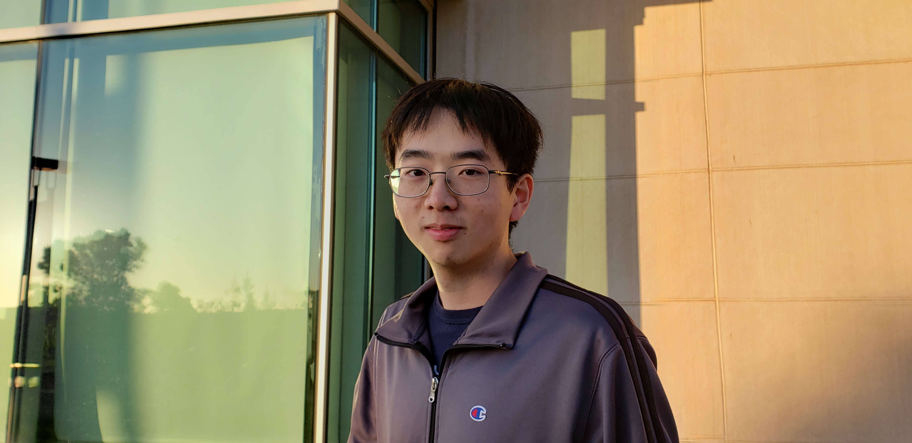

# Welcome to my github page
I don't know what I'm doing but hello

### Who am I
My name is Dylan Cullen, and I'm a third year computer engineering student.

In the words of the entire ECE department:
> This guy is pretty cool

### What am I
**I like some of the following things:**
- video games
- dungeons and dragons
- ~~exercise~~
- dr pepper
- anxiety

**My favorite c++ method is**
```
myString.size();
```
I wrote [this file](README.md)

### Where am I
help im lost

this is my roommate steve


### When am I
finishing my assignments (rated)
1. 3am
2. 1am
3. 1pm
4. 5pm
5. never

### Why am I
[This is my grandfather](https://www.pe.com/2015/07/10/riverside-resident-to-compete-in-international-whistling-competition/)

### Todo
- [x] be born
- [x] graduate high school
- [ ] graduate college
- [ ] go to mars
- [ ] use my $3 off supercuts coupon i've been keeping in my wallet